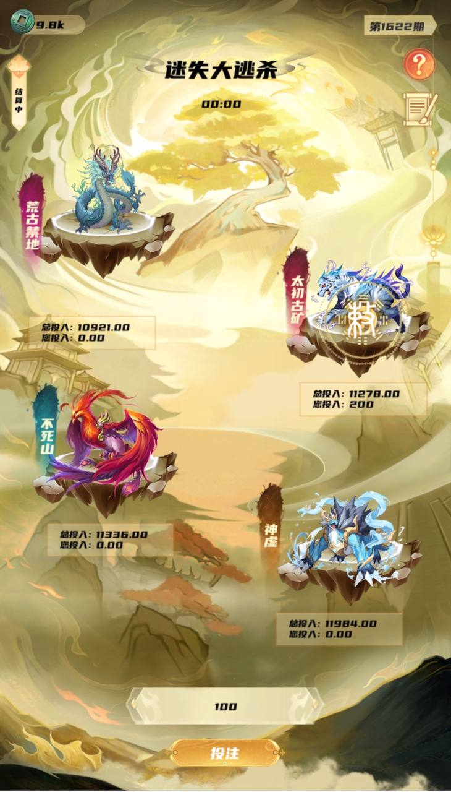

1.	玩法介绍：

a)	用户可以选择任意阵营参与游戏，投入您的资产，等到倒计时结束，您会参与瓜分失败玩家的投注资产。迷失大逃杀模式，您可以选择“荒古禁地”,“太初古矿”,“不死山”,“神虚”,四个阵营中任意选项，可以选择多个，也可以选择一个，进行参与。

b)	选择之后，在游戏界面底部输入投注的金额，注意金额只能是整数，例如10，15，100，203等，不能输入小数金额。

c)	您可以在您参与的阵营下方，看见您投注的金额，以及当前阵营玩家投注的总金额。

d)	待您输入金额之后，点击页面底部的“投注”按钮，即可参与您选择的阵营。

e)	等到界面顶部的倒计时结束，系统会自动进行结算。也将您参与的结果给予反馈。如果您的获得数值大于0，那表示您参与的某些阵营获得了胜利，并获得了奖励，如果获得金额等于0，即表示您失败，失败不会有任何奖励，且系统会显示您总共投入，以及总的产出金额。

f)	如果您胜利了，系统会抽取6%的税收，作为系统的运行成本。

g)	简单的概括就是系统会随机出局一个阵营，并将这个出局阵营所有玩家投入资产的94%按照投入占比，分别配给其他阵营的玩家

### 示例图片：

了解更多 ，请私信：[@CodeSaler](https://t.me/codeSaleAndRelease)
